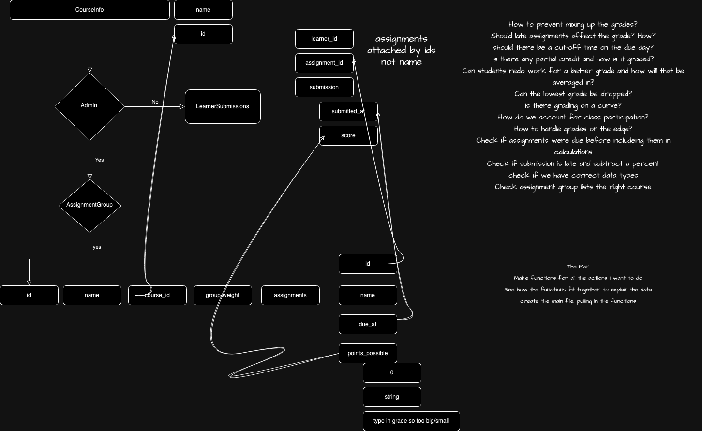

### SBA 308: JavaScript Fundamentals

### Objectives

- Employ basic JavaScript syntax accurately.
- Implement control flow structures such as conditionals and loops effectively.
- Use arrays and objects to organize and manage data.
- Develop functions to create reusable code.
- Utilize loops and iteration to navigate through data collections.
- Implement error handling to manage potential code failures gracefully.

### Submission

- Submit the link to your completed assessment using the Start Assignment button on the Assignment page in Canvas.
- Your submission should include:
  A GitHub link to your completed project repository.

### Instructions

- You will create a script that gathers data, processes it, and then outputs a consistent result as described by a specification. - This is a very typical situation in industry, and this particular scenario has been modified from a real application. The data you will use is provided below.

You will be provided with four different types of data:

- A CourseInfo object, which looks like this:
  {
  "id": number,
  "name": string,
  }

- An AssignmentGroup object, which looks like this:
  {
  "id": number,
  "name": string,
  // the ID of the course the assignment group belongs to
  "course_id": number,
  // the percentage weight of the entire assignment group
  "group_weight": number,
  "assignments": [AssignmentInfo],
  }

- Each AssignmentInfo object within the assignments array looks like this:
  {
  "id": number,
  "name": string,
  // the due date for the assignment
  "due_at": Date string,
  // the maximum points possible for the assignment
  "points_possible": number,
  }

- An array of LearnerSubmission objects, which each look like this:
  {
  "learner_id": number,
  "assignment_id": number,
  "submission": {
  "submitted_at": Date string,
  "score": number
  }
  }

Your goal is to analyze and transform this data such that the output of your program is an array of objects, each containing the following information in the following format:
{

- // the ID of the learner for which this data has been collected
  "id": number,
- // the learner’s total, weighted average, in which assignments
  // with more points_possible should be counted for more
  // e.g. a learner with 50/100 on one assignment and 190/200 on another
  // would have a weighted average score of 240/300 = 80%.
  "avg": number,
- // each assignment should have a key with its ID,
  // and the value associated with it should be the percentage that
  // the learner scored on the assignment (submission.score / points_possible)
  <assignment_id>: number,
  /- / if an assignment is not yet due, it should not be included in either
  // the average or the keyed dictionary of scores
  }

If an AssignmentGroup does not belong to its course (mismatching course_id), your program should throw an error, letting the user know that the input was invalid. Similar data validation should occur elsewhere within the program.

You should also account for potential errors in the data that your program receives. What if points_possible is 0? You cannot divide by zero. What if a value that you are expecting to be a number is instead a string?

Use try/catch and other logic to handle these types of errors gracefully.

If an assignment is not yet due, do not include it in the results or the average. Additionally, if the learner’s submission is late (submitted_at is past due_at), deduct 10 percent of the total points possible from their score for that assignment.

Create a function named getLearnerData() that accepts these values as parameters, in the order listed: (CourseInfo, AssignmentGroup, [LearnerSubmission]), and returns the formatted result, which should be an array of objects as described above.

You may use as many helper functions as you see fit.

### Example

Below, we included a live example showing a specific set of input data, and the resulting output. Our program simply logs the appropriate result - attempting to circumvent the assignment by doing this will result in a failing grade.
Use the sample data within this sandbox to begin your program, and test against the given result.
Afterwards, alter the data to test for edge cases, error handling, and other potential issues.

### Requirements

The requirements listed here are absolute minimums. Ensure that your application meets these requirements before attempting to further expand your features.
Create your application locally, and initialize a local git repo. Make frequent commits to the repo. When your application is complete, push your repo to GitHub and submit the link to the GitHub page using the submission instructions at the top of this document.

### Reflection (Optional)

- Once you have completed your project, answer the following questions to help solidify your understanding of the process and its outcomes, as well as improve your ability to handle similar tasks in the future.
- What could you have done differently during the planning stages of your project to make the execution easier?
- Were there any requirements that were difficult to implement? - What do you think would make them easier to implement in future projects?
- What would you add to, or change about your application if given more time?
- Use this space to make notes for your future self about anything that you think is important to remember about this process, or that may aid you when attempting something similar again:

### THE PLAN

### THE OUTPUT

